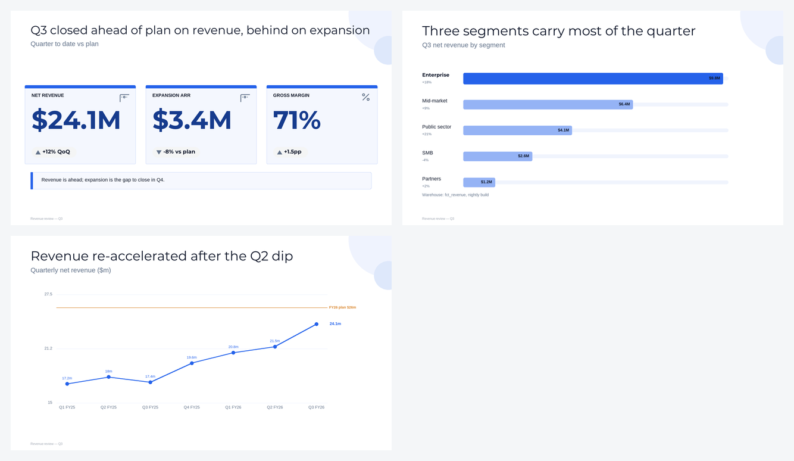

# Recipe — warehouse numbers → a stakeholder deck

**The problem:** the pipeline produces the truth, then someone retypes it into slides. The deck and the
warehouse drift, and in the review nobody can say which number is right.

**The fix:** render the deck **from the same run that produced the numbers**. The slide shows the
pipeline's output verbatim, so the deck is auditable against the run that made it.



*Rendered from [`examples/analytics-review.json`](../examples/analytics-review.json) — KPI board with a
takeaway, ranked segments, trend against plan. 3 slides, $0.15.*

## The workflow

```yaml
name: Quarterly review deck
on:
  workflow_run:
    workflows: ["dbt build"]        # run after the pipeline, not on a guess
    types: [completed]
  workflow_dispatch:

jobs:
  deck:
    if: ${{ github.event.workflow_run.conclusion == 'success' }}
    runs-on: ubuntu-latest
    steps:
      - uses: actions/checkout@v4

      - name: Query the warehouse
        env:
          SNOWFLAKE_URL: ${{ secrets.SNOWFLAKE_URL }}
        run: python scripts/build_review_deck.py > deck.json

      - id: deck
        uses: smartdatabrokers/slideforge-deck-action@v1
        with:
          api-key: ${{ secrets.SLIDEFORGE_API_KEY }}
          deck: deck.json
          output: quarterly-review.pptx
          fail-on-warnings: true      # a review deck should be clean or not ship

      - uses: actions/upload-artifact@v4
        with: { name: quarterly-review, path: quarterly-review.pptx }
```

Triggering on `workflow_run` (not a cron) is the point: the deck can't be built from numbers that
haven't landed yet.

## The generator step

```python
# scripts/build_review_deck.py
import json
rows   = query("select segment, revenue, yoy from fct_revenue_by_segment where quarter = :q")
series = query("select quarter, revenue from fct_revenue_quarterly order by quarter")
tot    = sum(r["revenue"] for r in rows)

print(json.dumps({
  "name": "Revenue review — Q3",
  "slides": [
    {"form": "kpi_metrics",
     "headline": "Q3 closed ahead of plan on revenue, behind on expansion",
     "context": "Quarter to date vs plan",
     "data": {"metrics": [
        {"label": "Net revenue",   "value": f"${tot:.1f}M", "delta": "+12% QoQ"},
        {"label": "Expansion ARR", "value": "$3.4M",        "delta": "-8% vs plan"},
        {"label": "Gross margin",  "value": "71%",          "delta": "+1.5pp"}]},
     "takeaway": "Revenue is ahead; expansion is the gap to close in Q4."},

    {"form": "bar_rank_chart", "headline": "Three segments carry most of the quarter",
     "context": "Q3 net revenue by segment",
     "data": {"categories": [
        {"label": r["segment"], "value": r["revenue"],
         "display": f"${r['revenue']:.1f}M", "sublabel": f"{r['yoy']:+.0f}%",
         **({"emphasis": "primary"} if i == 0 else {})}
        for i, r in enumerate(sorted(rows, key=lambda x: -x["revenue"]))]},
     "source_note": "Warehouse: fct_revenue, nightly build"},

    {"form": "trend_chart", "headline": "Revenue re-accelerated after the Q2 dip",
     "context": "Quarterly net revenue ($m)",
     "data": {"periods": [s["quarter"] for s in series],
              "series": [{"label": "Net revenue", "values": [s["revenue"] for s in series],
                          "unit": "m", "emphasis": "primary"}],
              "target": {"value": 26, "label": "FY26 plan $26m"}}},
  ],
}))
```

Two habits worth copying from it:

- **`source_note` on every data slide.** "Warehouse: fct_revenue, nightly build" turns a review argument
  into a lookup.
- **`emphasis: "primary"`** on the row that matters, so the chart makes the point rather than just
  displaying data.

## Notes

- **`fail-on-warnings: true`** is deliberate here. For an internal weekly you may want the deck even
  with a warning; for a deck going to a board or a customer, a warning should stop the line.
- **Don't round in the deck-builder and again in the query** — pick one place. `display` carries the
  formatted string while `value` drives the bar length, so format once, in the generator.
- The deck is reproducible: re-running the same pipeline output renders an identical deck (and an
  identical re-render is free), which is what makes "which number is right?" answerable.
