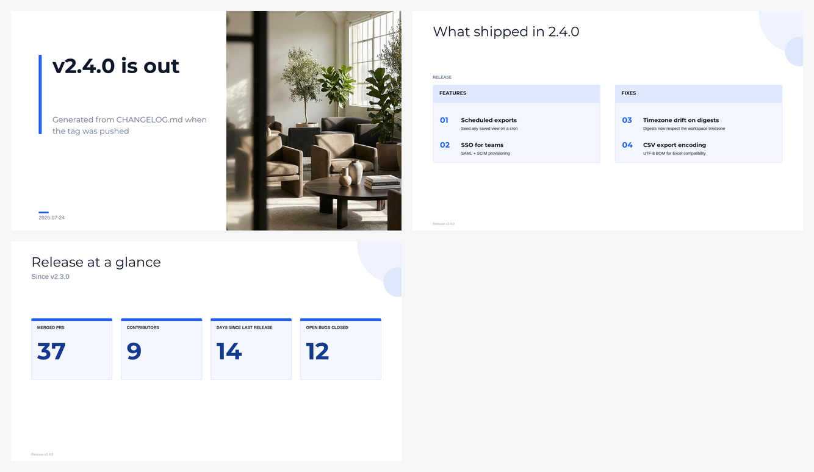

# Recipe — a release deck on every tag

**The problem:** every release, someone in sales enablement or CS asks "what actually shipped?" and
somebody hand-writes a summary deck — usually late, usually from the changelog anyway.

**The fix:** when you push a tag, build the deck from `CHANGELOG.md` (or the merged PRs) and attach it
to the GitHub release.



*Rendered from [`examples/release-notes.json`](../examples/release-notes.json) — cover, grouped
what-shipped list, release stats. 3 slides, $0.15.*

## The workflow

```yaml
name: Release deck
on:
  push:
    tags: ["v*"]

jobs:
  deck:
    runs-on: ubuntu-latest
    permissions:
      contents: write          # to attach the deck to the release
    steps:
      - uses: actions/checkout@v4
        with: { fetch-depth: 0 }   # need history for the PR list

      - name: Build deck from the changelog
        run: python scripts/build_release_deck.py "${GITHUB_REF_NAME}" > deck.json

      - id: deck
        uses: smartdatabrokers/slideforge-deck-action@v1
        with:
          api-key: ${{ secrets.SLIDEFORGE_API_KEY }}
          deck: deck.json
          output: release-${{ github.ref_name }}.pptx

      - name: Attach to the release
        env:
          GH_TOKEN: ${{ github.token }}
        run: gh release upload "${GITHUB_REF_NAME}" "${{ steps.deck.outputs.pptx-path }}"
```

## The generator step

`agenda_list` groups items under headers — a natural fit for Features / Fixes:

```python
# scripts/build_release_deck.py
import json, subprocess, sys, datetime
tag = sys.argv[1]

# Whatever your source of truth is: CHANGELOG.md, `gh pr list`, or git log.
sections = parse_changelog("CHANGELOG.md", tag)     # {"Features": [...], "Fixes": [...]}

blocks = []
for header, items in sections.items():
    blocks.append({"label": header, "kind": "header"})
    for it in items:
        blocks.append({"label": it["title"], "meta": it["ref"], "sub": it["summary"]})

prs = subprocess.check_output(["git", "log", "--oneline", f"{prev_tag(tag)}..{tag}"]).decode().splitlines()

print(json.dumps({
    "name": f"Release {tag}",
    "slides": [
        {"form": "hero_statement", "headline": f"{tag} is out",
         "context": "Generated from CHANGELOG.md when the tag was pushed",
         "date": datetime.date.today().isoformat()},
        {"form": "agenda_list", "headline": f"What shipped in {tag}",
         "subject": "RELEASE", "blocks": blocks},
        {"form": "kpi_metrics", "headline": "Release at a glance",
         "context": f"Since {prev_tag(tag)}",
         "data": {"metrics": [
             {"label": "Merged PRs", "value": str(len(prs))},
             {"label": "Contributors", "value": str(count_authors(tag))},
             {"label": "Days since last release", "value": str(days_since(tag))},
         ]}},
    ],
}))
```

## Variations

- **Customer-facing vs internal.** Generate two decks from the same data with different filters — one
  with issue numbers and internals, one with just the user-visible changes. Same script, one flag.
- **Per-audience theming.** Pass a different `theme-id` for the sales deck vs the engineering readout.
- **Only on stable tags:** `if: ${{ !contains(github.ref_name, '-rc') }}` so release candidates don't
  generate decks.

## Notes

- Keep the changelog parse honest: if an entry has no user-facing summary, don't invent one — the deck
  should reflect what you actually wrote. `fidelity: verbatim` means the slide shows your words, so the
  quality of the deck is the quality of your changelog (a useful forcing function).
- The action fails if the render isn't usable, so a malformed changelog breaks the build rather than
  producing a deck full of empty bullets — and nothing is billed when it refuses.
